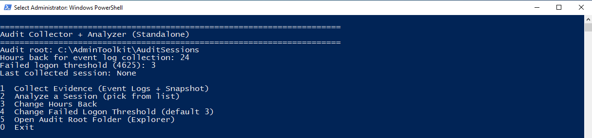
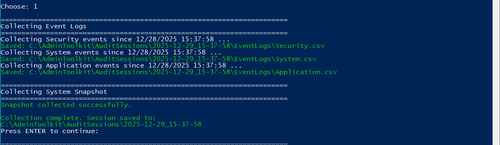
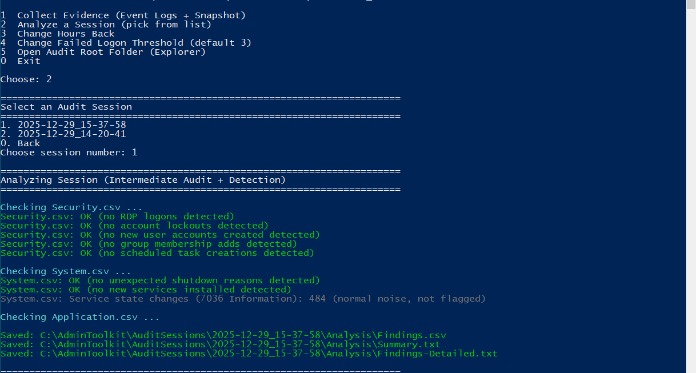
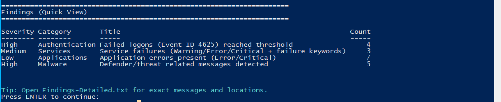

# \# Windows Audit Collector + Analyzer (PowerShell 5.1 / Server 2022)

# 

# A menu-driven PowerShell tool that \*\*collects Windows logs + system evidence\*\*, saves it into a \*\*timestamped session folder\*\*, then \*\*analyzes the session\*\* to highlight suspicious activity and important admin/security events.

# 

# This tool is designed for:

# \- Lab learning

# \- Intermediate SOC / analyst practice

# \- Portfolio demonstration

# \- Fast auditing without manually digging through Event Viewer

# 

# ---

# 

# \## What This Tool Does

# 

# \### 1) Collect Evidence (Creates an Audit Session)

# When you run a collection, the tool creates a folder like:

# 

# `C:\\AdminToolkit\\AuditSessions\\2025-12-29\_15-37-58\\`

# 

# Inside it, it saves:

# 

# Event Logs (exported from Event Viewer as CSV):

# \- `EventLogs\\Security.csv`

# \- `EventLogs\\System.csv`

# \- `EventLogs\\Application.csv`

# 

# System Snapshot (current system state at collection time):

# \- `Snapshot\\ComputerInfo.txt`

# \- `Snapshot\\IpConfig.txt`

# \- `Snapshot\\TcpConnections.txt`

# \- `Snapshot\\ListeningPorts.txt`

# \- `Snapshot\\Services.csv`

# \- `Snapshot\\FirewallRules.csv`

# 

# ---

# 

# \### 2) Analyze Session (Detects Suspicious Patterns)

# The tool analyzes the session files and produces reports:

# 

# \- `Analysis\\Findings.csv` (structured findings, easy for Excel)

# \- `Analysis\\Summary.txt` (simple summary)

# \- `Analysis\\Findings-Detailed.txt` (exact event evidence: file + time + event ID + message snippet)

# 

# The analyzer focuses on common intermediate audit tasks, such as:

# \- Failed logons (4625) with a configurable threshold (default: 3)

# \- RDP logons (4624 Logon Type 10)

# \- Account lockouts (4740)

# \- New users created (4720)

# \- Group membership changes (4728 / 4732 / 4756)

# \- Scheduled task created (4698, if enabled)

# \- Unexpected shutdown events (1076 / 6008)

# \- New service installs (7045)

# \- Service failures (Warning/Error/Critical)

# \- Application crash/error events

# 

# ---

# 

# \## Requirements

# 

# \- Windows Server 2022 (or Windows 10/11)

# \- PowerShell 5.1 (default on Server 2022)

# \- Run PowerShell as Administrator (recommended for Security logs)

# 

# ---

# 

# \## How to Run

# 

# \### Step 1) Open PowerShell as Administrator

# \- Start menu

# \- Search \*\*PowerShell\*\*

# \- Right-click → \*\*Run as Administrator\*\*

# 

# \### Step 2) Allow script execution for this session only

# ```powershell

# Set-ExecutionPolicy -Scope Process Bypass -Force

# ```


# \### Step 3) Run the script

# 

# Example:

# ```powershell

# cd D:\\Github\\windows-audit-collector-analyzer

# .\\Audit-Collector-Analyzer.ps1

# ```

# ---


# \## Output Locations

# 

# By default, sessions are stored in:

# 

# C:\\AdminToolkit\\AuditSessions\\

# 

# Each collection creates a new timestamped folder:

# 

# C:\\AdminToolkit\\AuditSessions\\<timestamp>\\

# &nbsp; EventLogs\\

# &nbsp; Snapshot\\

# &nbsp; Analysis\\


# ---


# \## Screenshots

# 

# Below are example screenshots from a lab environment.

# 

# Main Menu




# Evidence Collection (Event Logs + Snapshot)




# Session Analysis Results (Findings)




# Detailed Findings Output




# ---


# \## Notes

# 

* # This tool is read-only (it does not change system configuration).

# 

* # It is designed to help you quickly find important events without manually searching through Event Viewer.

# 

* # Findings are based on pattern detection and thresholds. A clean report does not guarantee the system is clean.


